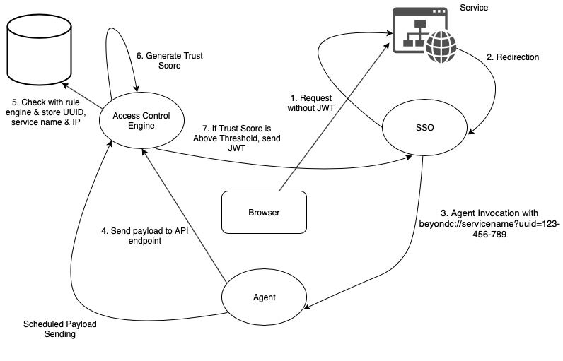

# Quick Heal - BE Project

### Abstract
Virtual private networks have been the backbone of corporate network security for many years and are still considered as a viable solution for securing internal networks. As companies adopt mobile and cloud technologies, the perimeter is becoming increasingly difficult to enforce. Companies use firewalls to make their private network strong and robust to external threats. This perimeter security solution is flawed - if the perimeter security is compromised, then an attacker has relatively easy access to a highly privileged corporate network. VPN clients allow employees to access the intranet even if they are not in the network perimeter. We propose a new approach to tighten the corporate network security and completely eliminate the need for VPN clients. Our novel network architecture is one where Intranet services can be accessed over the Internet, safeguarded by an access control proxy.

### Design
The project is divided into 4 modules:

1) Agent
2) Single Sign On + Access Proxy
3) Access Control Engine + Database
4) Website Service

### Implementation

#### Technical Terminologies

1. **JWT**:
A JSON Web Token (JWT) is JSON Object which is used to securely transfer information over the web (between two parties). It is used for an authentication system and can also be used for information exchange. The token is mainly composed of header, payload, signature. JWT defines the structure of information we are sending from one party to the other.

2. **OSQuery**:
OSquery is an open source tool created by Facebook which is an agent software running directly on the endpoints for querying various information about the state of the machines.

3. **SSO**:
Single sign-on (SSO) is a session and user authentication service that permits a user to use one set of login credentials to access multiple applications / services.

4. **Access Control Engine**:
An Access Control Engine within the access proxy provides service-level authorization to enterprise applications on a per-request basis. The authorization decision makes assertions about the user, the device certificate, and artifacts of the device from the database. If necessary, the Access Control Engine can also enforce location-based access control. The inferred level of trust in the user and the device is also included in the authorization decision.

### Working

#### This implementation follows 8 steps:

1. Initial Step: The browser tries to access the service. The client is not logged in and hence doesn't have a JSON Web Token (JWT).

2. The service redirects the client to the SSO (Single Sign On service), due to the absence of JWT.

3. The SSO implementation generates a unique URI of the format - beyondc://servicename?uuid=123-456-7890 and redirects the client browser to this custom protocol handler.

4. The agent installed on the client parses the service name & UUID from this invocation. This agent queries the OSQuery data from the OSQuery module and sends a payload containing this data and the service name: UUID and IP address of the client to the REST API endpoint at the Access Control Engine. This HTTP payload is signed before sending.

5. The Access Control Engine (ACE) inserts this payload into the database.

6. The ACE, on the basis of the predefined rule set generates a single-value trust score.

7. If the trust score is above the predefined threshold value, then the client is authorised to access the service, and hence is given a JWT signed by the ACE.

8. After authentication, all the requests to the service are proxied via the SSO server. The SSO server validates the JWT embedded in every HTTP request after authentication.
The agent sends the payload to the ACE at periodic intervals (Interval duration is decided by the trust score), and the ACE keeps track of the current trust score of the client. If it drops below the threshold, it immediately informs the SSO to revoke access to all the currently authorised services.

The following diagram provides an overview of the entire architecture.  

